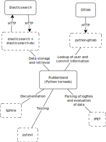

Roadmap
=======

Roles and interplay of the components
-------------------------------------

    Interplay of single components to rubberband application.

Webserver
_________

The webserver hosts both the proxy and the tornado application that we call rubberband.
It organizes and forwards requests between user and application.

oauth2_proxy: Authentication proxy
__________________________________

This proxy listens on a public port and decides if a user is allowed access or not.
It authenticates the user against Gitlab or a different tool of your choice.

rubberband: Tornado python application
______________________________________

This application receives requests from and sends answers back to the user.
It processes the data, converses with the database and the gitlab instance.
All the magic happens here.
There is more tools that are utlized for a userfriendly look of the website:

   * CSS: `Bootstrap <http://TODO>`_
   * Javascript: `Bootstrap <http://TODO>`_, `JQuery <http://TODO>`_, `DataTable <http://TODO>`_

Gitlab connection
_________________

Rubberband may parse from the logfile the githash of the version of the binary that the Testrun was run with.
Gitlab then provides rubberband with detailed information about this commit, like timestamp, user etc. which in turn gets linked back for the user to see.

Elasticsearch: database
_______________________

The database is the place where the parsed data and the raw logfiles are stored.
It provides means for rubberband to query for specific data and systematic organization of information.

IPET: Logfile parse and evaluation tool
_______________________________________

When a set of logfile is uploaded, then it needs to be processed.
This is one of the roles of IPET, it parses the data and returns a DataFrame of information.
The second role is the evaluation of data to compare and investigate multiple uploaded testruns.

Examples (TODO)
---------------

What happens on the server when a user sends a request to a rubberband.example url?
___________________________________________________________________________________

1. The webserver receives the request and forwards it to the authentication proxy.
2. The authentication proxy oauth2_proxy authenticates the user and returns it to the webserver.
3. The webserver receives the request and passes it to the rubberband tornado application.
4. Rubberband processes the request and sends back a response to the user.

How does Rubberband form a response?
____________________________________

Assume the request looks like this:

``GET rubberband.example/search``

   1. Tornado matches the url via a regular expression to a RequestHandler class while passing the arguments, see ``rubberband/routes.py``.
   2. In the RequestHandler the method gets called that matches the method of the HTTP request, in our case ``SearchView.get(...)`` in ``rubberband/handlers/fe/search.py``.
   3. The method evaluates the request, possibly passed arguments and may query the database via the `elasticsearch_dsl <http://TODO>`_ python module.
   4. At the end of the method usually a response is rendered from the gathered data and an html template and sent back to the user, in our example the template is ``rubberband/templates/search_view.html``.

How do rubberband and elasticsearch communicate?
________________________________________________

They communicate via ``elasticsearch_dsl``, which is a python module that forms HTTP Requests to Elasticsearch from python code and objects.

