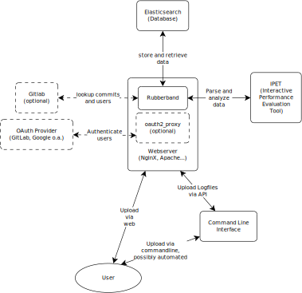

.. Rubberband documentation master file, created by
   sphinx-quickstart on Thu Nov 16 11:15:57 2017.
   You can adapt this file completely to your liking, but it should at least
   contain the root `toctree` directive.

Welcome to Rubberband's documentation!
======================================

Rubberband is a flexible archiving and analysis tool written in python for optimization benchmarks.
Its main purpose is the organization and evaluation of logfiles of Solvers during development.
Rubberband consists of a python `tornado <http://www.tornadoweb.org/en/stable/>`_ application running on a webserver (like nginx or apache) and can authenticate users via `oauth2_proxy <http://github.com/bitly/oauth2_proxy>`_.
There is an optional `gitlab <http://gitlab.com/>`_ connection for linkage of users and commits.
All of the data is stored in an `elasticsearch <http://www.elastic.co/products/elasticsearch>`_ database, including the logfiles themselves.
As a tool for parsing the logfiles, rubberband utilizes `IPET <http://github.com/GregorCH/ipet>`_.

    Rubberband and its interaction with other services.

Table of contents
=================

.. toctree::
   :maxdepth: 2

   Readme <_static/README>
   _static/configuration
   _static/documentation
   Contributing <_static/CONTRIBUTING>
   _static/roadmap
   _static/folderstructure
   _static/crashcourses

   _modules/rubberband/rubberband

   genindex
